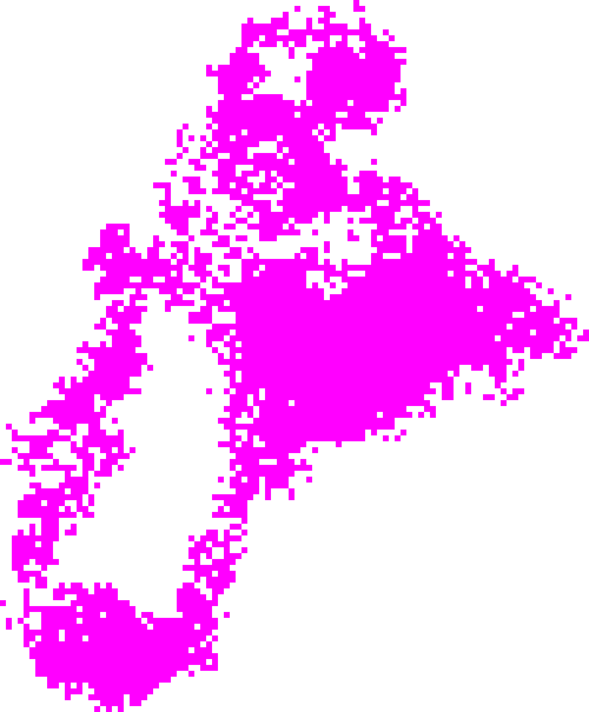

# Fairly-Simple Minecraft Editor
A simple minecraft bedrock edition save file format decoder (work in progress)

Current Progress:
- draw and export chunk structure, example from my testworld:

- export parsed world/player data in:

[worldData/level.json](worldData/level.json) <- level.dat 
[worldData/player.json](worldData/player.json) <- ~local_player 
[worldData/plain.txt](worldData/plain.txt) <- FSmcedit.exe stdoutput

- export chunk data in

[worldData/chunk_x_y.json](worldData/chunk_0_0.json)

- export other player's data on server in

[worldData/player_server_<Id>.json](worldData/player_server_4a91b90d-1047-42d0-a2ed-d17a1f48638e.json)